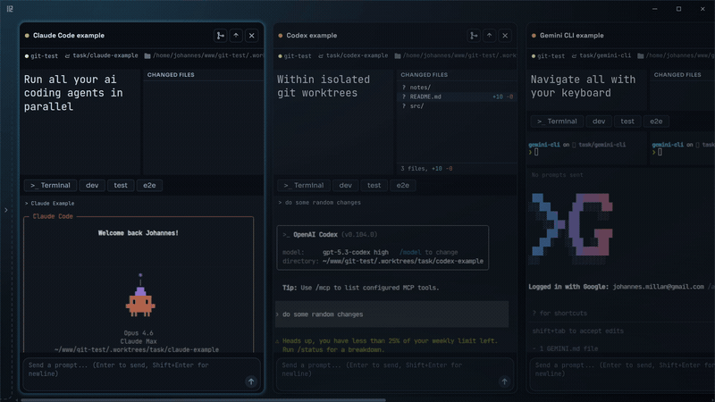
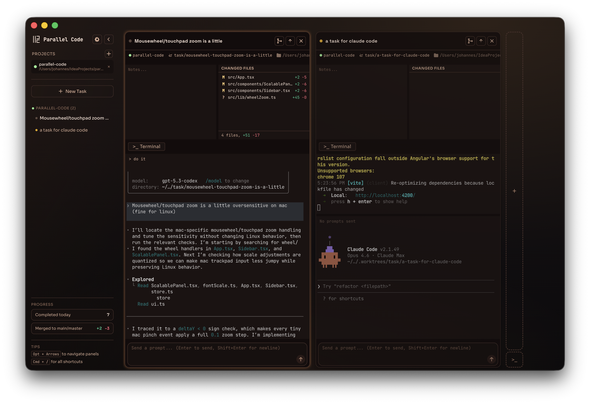
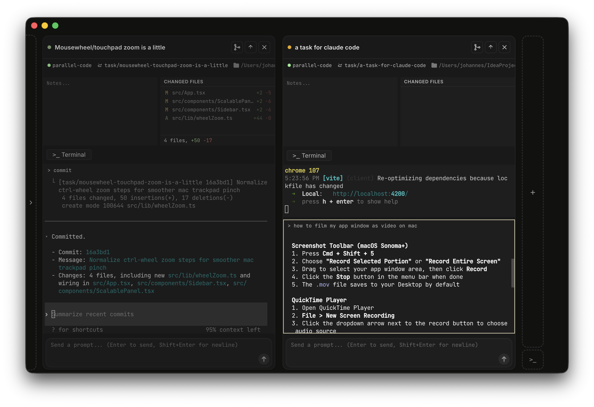
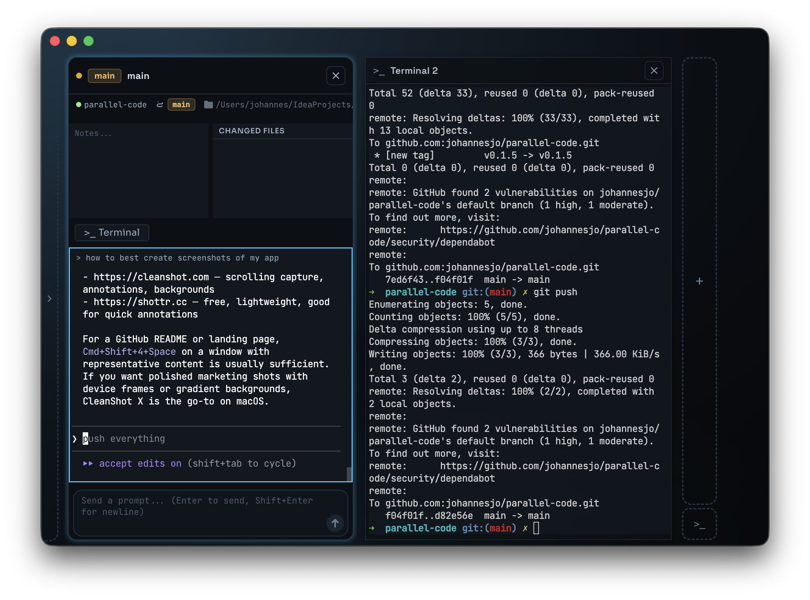
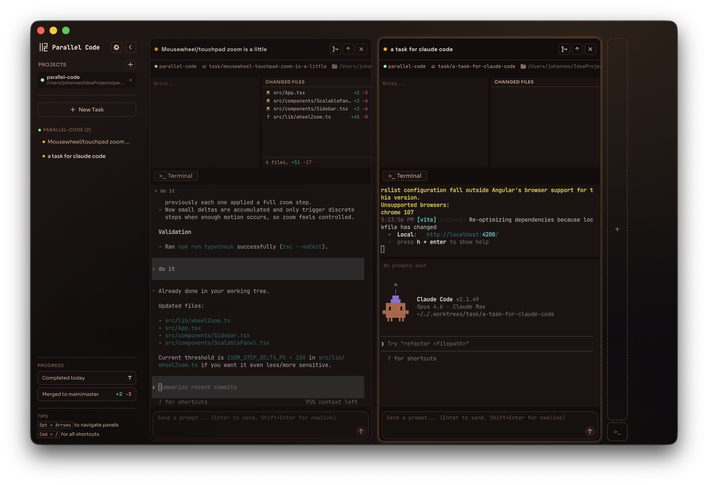

<p align="center">
  
</p>

<p align="center">
  Run multiple AI coding agents without the chaos.
</p>

<p align="center">
  
  
  
  
  
  
</p>

<p align="center">
  
</p>

**Parallel Code** keeps Claude Code, Codex CLI, Gemini CLI, and project shells in one task-centric interface. Isolated agent tasks get their own git branch and worktree by default; when isolation is not what you need, you can explicitly work in the project root, import an existing worktree, or create a terminal-only task with no AI agent. Merge results stay visible when they are ready, and you can monitor agent work from your phone.

## Screenshots

| Agent working on a task                       | Commit & merge workflow           |
| --------------------------------------------- | --------------------------------- |
|    |  |
| **Project-root task (main branch)**           | **Themes**                        |
|  |      |

## Why Parallel Code?

Running multiple AI coding agents can get messy. On the same branch, agents interfere with each other's code. Across terminals, you lose track of what is happening where. Manual feature branches and worktrees work, but they add coordination work before the agent can start.

| Approach                                           | What's missing                                                                          |
| -------------------------------------------------- | --------------------------------------------------------------------------------------- |
| **Multiple terminal windows / tmux**               | No GUI, no automatic git isolation — you manage worktrees, branches, and merges by hand |
| **VS Code extensions** (Kilo Code, Roo Code, etc.) | Tied to VS Code; no true parallel worktree isolation between agents                     |
| **Running agents sequentially**                    | One task at a time — blocks your workflow while each agent finishes                     |

Parallel Code puts the GUI, worktree isolation, and multi-agent orchestration in one app, so you can dispatch several tasks from the same repo and review them when they finish.

## How Parallel Code Solves It

For an isolated agent task—the default—Parallel Code:

1. Creates a new git branch from your main branch
2. Sets up a [git worktree](https://git-scm.com/docs/git-worktree) so the agent works in a separate directory
3. Symlinks `node_modules` and other gitignored directories into the worktree
4. Spawns the AI agent in that worktree

This lets five agents work on five features at the same time from the same repo, each on its own branch and worktree. When you're happy with the result, merge the branch back to main from the sidebar.

Task execution and Git location are independent choices.

Choose what runs:

- **Agent** launches the selected AI coding CLI and can also use task-scoped shells.
- **Terminal-only** starts a task-scoped shell without launching an AI agent.

Choose where it runs:

- **Worktree** is the isolated default. Parallel Code manages the branch and worktree; closing removes the managed worktree and follows the project's branch-cleanup setting.
- **Project root** works directly in the repository root on the selected branch. It is subtly flagged throughout the UI, the backend permits only one active project-root task for the same canonical repository, and closing keeps the root and branch.
- **Existing worktree** imports a linked worktree you already manage. Closing stops its runtimes but keeps the worktree and branch.

## Features

### One interface, every AI coding agent

Use [Claude Code](https://docs.anthropic.com/en/docs/claude-code), [Codex CLI](https://github.com/openai/codex), [Gemini CLI](https://github.com/google-gemini/gemini-cli), and Antigravity CLI from the same interface. Switch agents per task, or run several at once without managing separate terminal windows.

### 5 agents, 5 features, zero conflicts

Every isolated agent task gets its own git branch and [worktree](https://git-scm.com/docs/git-worktree). Agents work in separate checkouts, so you avoid shared-branch conflicts, stashing, and waiting on one task before starting another. Five agents, five features, one repo. Merge back to main when you're done.

### Walk away — monitor from your phone

Scan a QR code and watch agent terminals live on your phone over Wi-Fi, Tailscale, or any network. The mobile companion is a PWA with native terminal interaction, quick-action buttons, swipe gestures, and haptic feedback. Install it to your home screen for faster access.

### Browser mode — no Electron required

Run Parallel Code as a standalone Node.js server from any browser. Deploy it on a remote VM, a headless server, or WSL2, then open the UI at `http://your-server:43117`. The remote mobile app is available at `/remote`.

### Task-scoped preview — expose app ports safely

If a task starts a dev server, Parallel Code can track detected localhost ports, let you explicitly expose the ones you trust, and open them in an embedded preview. In browser mode, exposed ports are proxied through authenticated task-scoped preview URLs instead of forwarding arbitrary localhost services.

### Inline task attention — know which task needs you next

Parallel Code treats task supervision as backend-owned state. If an agent is waiting for input, idle at a prompt, failed, paused, flow-controlled, restoring, or quiet too long, that state appears on the task rows in the sidebar without depending on a mounted terminal.

### Inline review signals — know what is ready to merge next

Parallel Code derives a convergence model from branch diffs, merge status, and worktree status. Sidebar task rows show compact review signals for tasks that are ready to review, need refresh because main moved ahead, or have blocking uncommitted changes.

### Keyboard-first, mouse-optional

Navigate panels, create tasks, send prompts, merge branches, and push to remote without touching the mouse. Every action has a shortcut, and `Ctrl+/` shows them all.

### And more

- Tiled panel layout with drag-to-reorder
- Built-in diff viewer and changed files list per task
- Shell terminals per task, scoped to the task's selected Git location
- Terminal-only tasks with no AI agent
- Visually flagged project-root tasks for intentional non-isolated work
- Existing-worktree imports that remain user-owned on close
- Six themes — Minimal, Graphite, Classic, Indigo, Ember, Glacier
- State persists across restarts
- macOS, Linux, and WSL2

## Getting Started

**Prerequisites:** [Node.js](https://nodejs.org/) v18+. Agent tasks also require at least one AI coding CLI — [Claude Code](https://docs.anthropic.com/en/docs/claude-code), [Codex CLI](https://github.com/openai/codex), [Gemini CLI](https://github.com/google-gemini/gemini-cli), or Antigravity CLI. Terminal-only tasks do not require an AI CLI.

### Option 0: Docker - comes with prerequisites.

1. Copy `.env.example`

   `cp .env.example .env`

2. Set `HOST_SSH_AUTH_SOCK` to the real host ssh-agent socket path

   Linux example:

   `echo "$SSH_AUTH_SOCK"`

   Then copy that absolute path into `.env`, for example:

   `HOST_SSH_AUTH_SOCK=/run/user/1000/keyring/ssh`

   macOS example:

   `HOST_SSH_AUTH_SOCK=/run/host-services/ssh-auth.sock`

3. Start your ssh-agent and add your key if needed

   `ssh-add <path-to-key>`

4. Start the container

   `docker compose up --build`

   The compose stack publishes the same browser-mode default:
   `http://127.0.0.1:43117?token=parallel-code-local-browser`

This installs the app dependencies into the image and keeps container-managed `node_modules`
separate from your host checkout.

### Option 1: Desktop App (Electron)

Download the latest release from the [releases page](https://github.com/johannesjo/parallel-code/releases/latest):

- **macOS** — `.dmg` (universal)
- **Linux** — `.AppImage` or `.deb`

Open Parallel Code, point it at a git repo, and start dispatching tasks.

### Option 2: Browser Mode (Standalone Server)

Run without Electron — deploy on any machine with Node.js:

```sh
git clone https://github.com/johannesjo/parallel-code.git
cd parallel-code
npm install
npm run server        # builds everything, starts on port 43117
```

Open the URL printed in the terminal. Fresh checkouts load the checked-in local defaults from `.env.example`, so local browser mode uses a stable port and token across server restarts:

```text
http://127.0.0.1:43117?token=parallel-code-local-browser
```

Copy `.env.example` to `.env` only when you want to customize the local values:

```sh
cp .env.example .env
```

Change `AUTH_TOKEN` before exposing the server beyond local development.

The mobile-optimized remote app is available at `/remote` — installable as a PWA on your phone.
Before exposing browser mode outside localhost, read [PRIVACY.md](PRIVACY.md). Authenticated
browser clients can interact with live terminals, project state, and explicitly exposed previews.

For active browser UI development, use watch mode instead of `npm run server`:

```sh
npm run browser:dev
```

`npm run server` is a production-style build-and-serve path. `npm run browser:dev` watches the frontend, remote app, and server output and restarts the Node server automatically as files change. Watch mode writes static assets to `dist-browser-dev/` and `dist-remote-dev/`, leaves the production/test `dist/` artifacts stable for browser-free integration tests and Playwright, and bypasses the production freshness guard that expects built `dist/` assets.

### Option 3: Codex Account Switching Setup (Optional)

If you use Codex often and switch between multiple accounts, install `codex-auth` for fast account switching:

```sh
npm install -g @loongphy/codex-auth
codex login                      # or `codex-auth login --device-auth`
codex-auth login                 # add the currently signed-in Codex account
codex-auth switch                # switch active account interactively
```

Useful operational commands:

- `codex-auth list` — inspect stored accounts and usage state.
- `codex-auth status` — check whether auto-switch and API refresh are enabled.
- `codex-auth config auto enable` — enable background account switching.
- `codex-auth config api enable` — enable usage and account metadata refresh for switching decisions.

### Troubleshooting & local setup notes

- **macOS native dependencies.** A `postinstall` step (`scripts/postinstall-native-fixups.mjs`) runs automatically after `npm install`/`npm ci` to repair two macOS install issues: the `node-pty` `spawn-helper` execute bit (a missing `+x` causes every terminal to fail with `posix_spawnp failed`) and a half-extracted Electron binary. If you hit `posix_spawnp failed` or `Electron failed to install correctly`, re-run `node scripts/postinstall-native-fixups.mjs`. The Electron repair re-extracts from the local download cache; if the cache is absent, run `node node_modules/electron/install.js` with network access first.
- **Tests build their own artifacts.** `npm run test:node` builds the full browser artifacts (frontend, remote, server) before running because some browser-free integration tests boot the standalone server and assert on `dist/`. You do not need to build anything by hand first.
- **Docker test lanes are opt-in.** The `test:node:docker:*` lanes are skipped unless Docker is available; the default `npm test` / `npm run test:node` runs do not require Docker.

<details>
<summary><strong>All commands</strong></summary>

| Command                | Description                                        |
| ---------------------- | -------------------------------------------------- |
| `npm run browser:dev`  | Browser-mode dev server with isolated auto rebuild |
| `npm run dev`          | Start Electron app in dev mode                     |
| `npm run server`       | Build and start standalone server (port 43117)     |
| `npm run dev:server`   | Server dev mode with hot reload                    |
| `npm run build`        | Build browser/server artifacts and Electron        |
| `npm run build:remote` | Build remote mobile app to `dist-remote/`          |
| `npm run typecheck`    | Run app, lifecycle, and server type checking       |
| `npm test`             | Run the full node + Solid test suites              |
| `npm run test:node`    | Run node/transport/backend tests                   |
| `npm run test:solid`   | Run Solid/jsdom screen behavior tests              |

</details>

<details>
<summary><strong>Keyboard Shortcuts</strong></summary>

`Ctrl` = `Cmd` on macOS.

| Shortcut                | Action                         |
| ----------------------- | ------------------------------ |
| **Tasks**               |                                |
| `Ctrl+N`                | New task                       |
| `Ctrl+Shift+A`          | New task (alternative)         |
| `Ctrl+Enter`            | Send prompt                    |
| `Ctrl+Shift+M`          | Merge task to main             |
| `Ctrl+Shift+P`          | Push to remote                 |
| `Ctrl+W`                | Close focused terminal session |
| `Ctrl+Shift+W`          | Close active task              |
| **Navigation**          |                                |
| `Alt+Arrows`            | Navigate between panels        |
| `Ctrl+Shift+Left/Right` | Reorder active task            |
| `Ctrl+B`                | Toggle sidebar                 |
| **Terminals**           |                                |
| `Ctrl+Shift+T`          | New shell terminal             |
| `Ctrl+Shift+D`          | New standalone terminal        |
| **App**                 |                                |
| `Ctrl+,`                | Open settings                  |
| `Ctrl+/` or `F1`        | Show all shortcuts             |
| `Ctrl+0`                | Reset zoom                     |
| `Ctrl+Scroll`           | Adjust zoom                    |
| `Escape`                | Close dialog                   |

</details>

## Remote Mobile App

The `/remote` route serves a dedicated mobile-optimized terminal interface:

- **Full terminal interaction** — native keyboard input, not just monitoring
- **Quick-action button bar** — grouped by category (Keys, Navigation, Signals) with long-press repeat on arrow keys
- **Swipe gestures** — swipe from the left edge to go back to the agent list
- **Agent management** — kill running agents with confirmation dialog
- **Terminal controls** — adjustable font size (A+/A-) with toast indicator, scroll-to-bottom FAB
- **PWA installable** — add to home screen
- **Accessibility** — full ARIA labels, reduced-motion support, focus-visible indicators
- **Resilient connection** — ping/pong heartbeat, auto-reconnect with status banners, loading skeletons
- **Haptic feedback** — vibration on button presses for tactile response

## Architecture

Start here if you are changing core behavior or reviewing a refactor:

- [PRIVACY.md](PRIVACY.md)
- [docs/ARCHITECTURAL-PRINCIPLES.md](docs/ARCHITECTURAL-PRINCIPLES.md)
- [docs/UPSTREAM-DIVERGENCE.md](docs/UPSTREAM-DIVERGENCE.md)
- [docs/REVIEW-RULES.md](docs/REVIEW-RULES.md)

These docs define the repo's privacy expectations, architecture rules, layer ownership, upstream-port workflow, and review guardrails.
If you are syncing upstream work, use the divergence playbook as the porting checklist and upstream sync-status reference.
If you are reviewing a non-trivial change, use the review-rules doc as the checklist for runtime, preview, and suite-stability pitfalls.
For non-trivial upstream ports, also follow the repo-level [AGENTS.md](AGENTS.md) workflow: classify first, map to the local owner, then validate at the correct seam.

For the current runtime walkthrough and testing strategy, see:

- [docs/ARCHITECTURE.md](docs/ARCHITECTURE.md)
- [docs/TESTING.md](docs/TESTING.md)

Parallel Code runs in two modes:

### Electron Mode (Desktop)

The desktop app uses native window management, system tray, and file dialogs. The frontend communicates with the backend through Electron IPC.

### Server Mode (Browser)

A standalone Express server bootstrapped from `server/main.ts` and composed in `server/browser-server.ts` serves the desktop frontend at `/` and the remote mobile app at `/remote`. WebSocket handles real-time terminal I/O. The browser frontend uses the same SolidJS codebase with an HTTP/WebSocket IPC transport layer (`src/lib/ipc.ts`) instead of Electron IPC.

```
┌──────────────────────────────────────────┐
│           Node.js Server                 │
│                                          │
│  ┌──────────┐   ┌──────────────────────┐│
│  │ PTY Pool │◄─►│ Browser Server Shell ││
│  │ (pty.ts) │   │ (browser-server.ts)  ││
│  └────┬─────┘   └──────┬─────────────┘  │
│       │                │                 │
│       ▼                ├── /     Desktop UI (SolidJS)
│  Ring Buffer           ├── /remote  Mobile UI (SolidJS)
│  (scrollback)          ├── /ws    WebSocket (I/O + control)
│                        └── /_preview/:taskId/:port/*  Authenticated preview proxy
└──────────────────────────────────────────┘
```

### Performance Optimizations

- **Binary WebSocket frames** for terminal output — 25% bandwidth reduction vs base64
- **WebGL context pooling** — LRU pool of 6 contexts prevents context loss flicker
- **Flow control via WebSocket** — pause/resume through the socket, not HTTP POST
- **Optimized output scheduling** — synchronous fast path for small chunks, RAF batching for large output
- **Terminal latency measurement** — built-in RTT probes and throughput benchmarks

### Reliability

- **Hundreds of automated tests** across the node and Solid suites
- **Attention inbox and backend supervision** — prompt-aware task attention driven by pushed backend state, not mounted-terminal polling
- **Bundled Hydra resolution** — runtime asset lookup works across Electron and standalone browser/server layouts
- **Task-scoped preview proxy** — detected localhost ports can be explicitly exposed and replayed to browser clients, then opened through authenticated preview routes
- **Review queue and convergence projection** — merge readiness, overlap warnings, and post-merge sibling refreshes are derived from canonical git data instead of being guessed in the UI
- **Unified bootstrap and replay registry** — Electron startup hydration and browser replay restore the same server-owned state categories through one shared registry instead of hand-maintained startup wiring
- **Coordinator guardrails** — startup/session sync, browser replay, review surfaces, and task presentation now have architecture tests that lock in ownership boundaries
- **Split test architecture**:
  - node suite for transport, workflows, IPC, PTY, latency, browser server, and contract coverage
  - Solid/jsdom suite for high-churn screen behavior, review flows, and startup-facing UI flows
- **Broadcast crash protection** — try/catch around WebSocket sends to disconnecting clients
- **Connection limiting** — post-authentication to prevent pre-auth DoS
- **Abandoned channel GC** — 30-second TTL on channels with no listeners
- **Ping/pong heartbeat** — 30s ping interval, 10s pong timeout for stale connection detection

---

If Parallel Code saves you time, consider giving it a [star on GitHub](https://github.com/johannesjo/parallel-code). It helps others find the project.

## License

MIT
